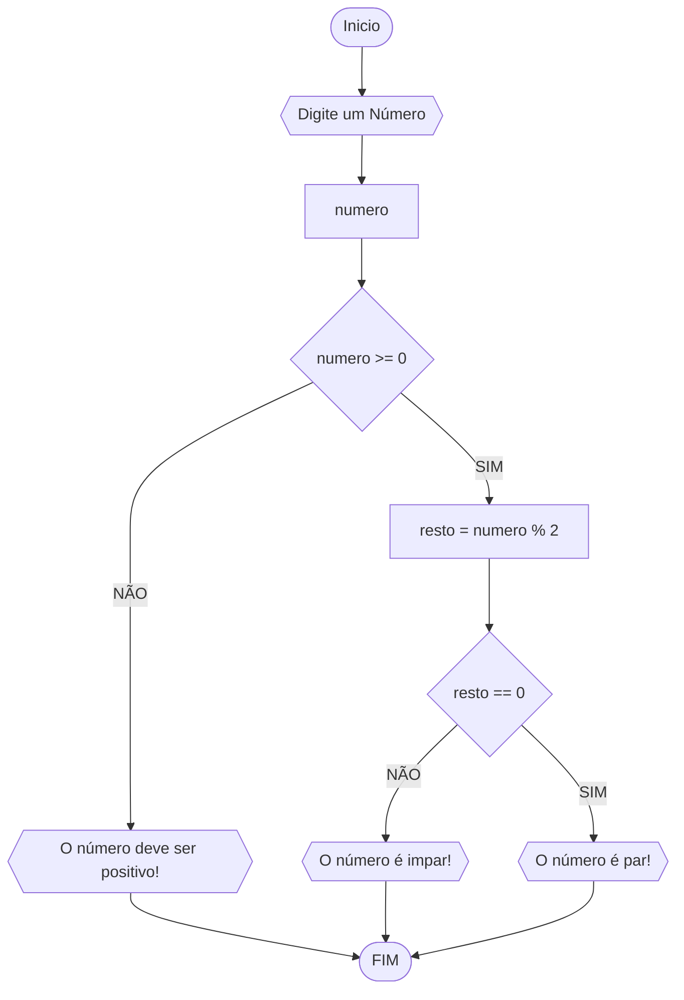

# UNIFOR
**Disciplina** Raciocíocinio Lógico Algorítimico
**Orientador:**: Prof. Ricardo Carubbi

## Lista de exercícios

### Exercício 03
Represente,emn fluxograma e pseudocódigo, um algoritmo para determinar se um ==número inteiro e positivo é par ou impar ==.

#### Fluxograma

### Pseudocódigo
```
1  ALGORITMO verifica_par_impar  
2  DECLARE numero, resto NUMERICO ESCREBA "Digite um número: "
3  LEIA numero
4  SE numero >= 0 ENTAO
5      resto <- numero % 2
6      SE resto == 0 ENTAO 
7         ESCREVA "O número é par!"
8     SENAO
9         ESCREVA "O número é impar!"
10    SENAO
11        ESCREVA "O número deve ser positivo"
13  FIM_ALGORITMO 
```

