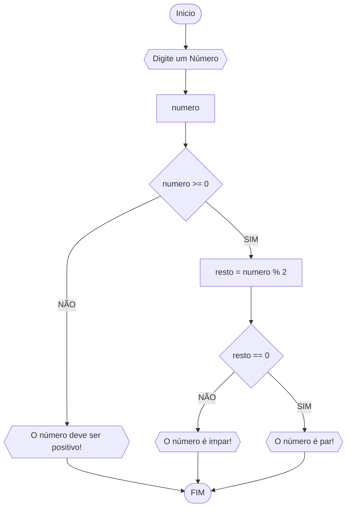

# UNIFOR
**Disciplina:** Raciocíocinio Lógico Algorítimico
**Orientador:** Prof. Ricardo Carubbi

## Lista de exercícios 2

### Exercício 01
Atualize o algoritmo para determinar se um número inteiro e positivo é par ou ímpar, usando uma laço condicional para aceitar apenas números maiores ou iguais a zero.

#### Fluxograma

### Pseudocódigo
```
1   inicio
2   numero <- -1
3   enquanto numero < 0 faça
4   escreva("Digite um número inteiro e positivo (0 ou maior): ")
5     leia(numero)
6      se numero < 0 então
7       escreva("Por favor, digite um número inteiro e positivo.")
8       fim_enquanto
9   se numero = 0 então
10       escreva("O número 0 é neutro.")
11    senão se numero % 2 = 0 então
12       escreva("O número ", numero, " é par.")
13      senão
14       escreva("O número ", numero, " é ímpar.")
15    fim

```
