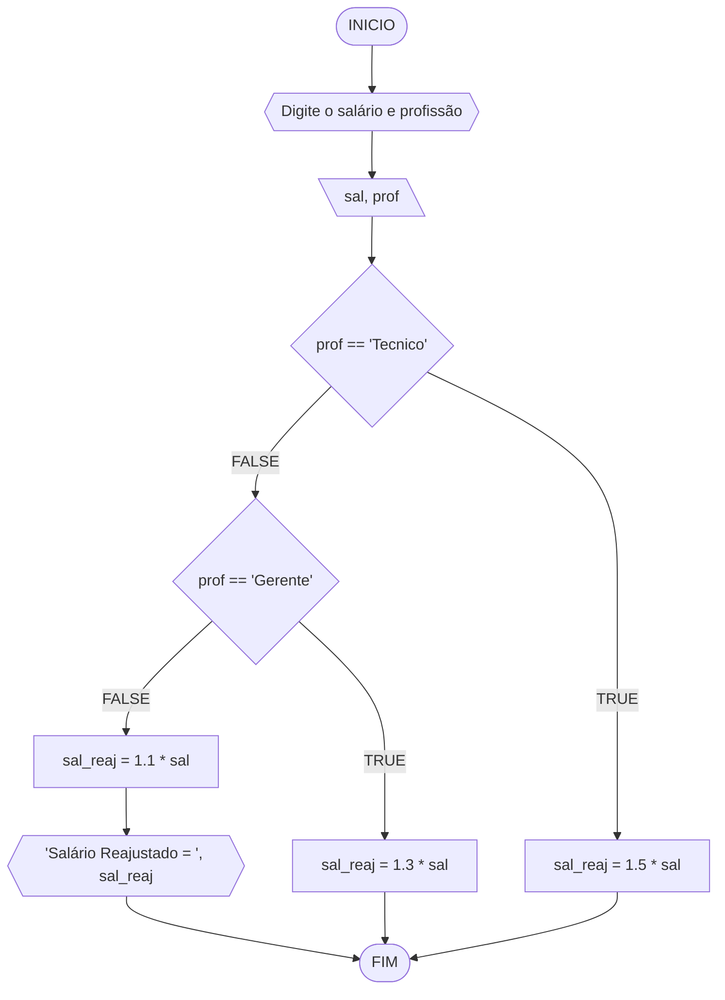
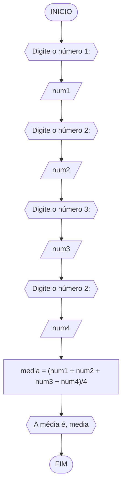
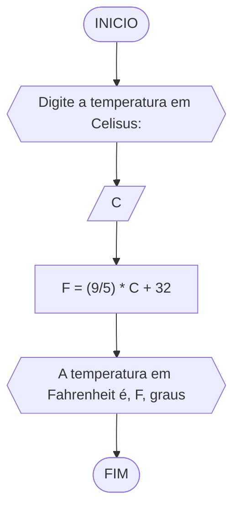
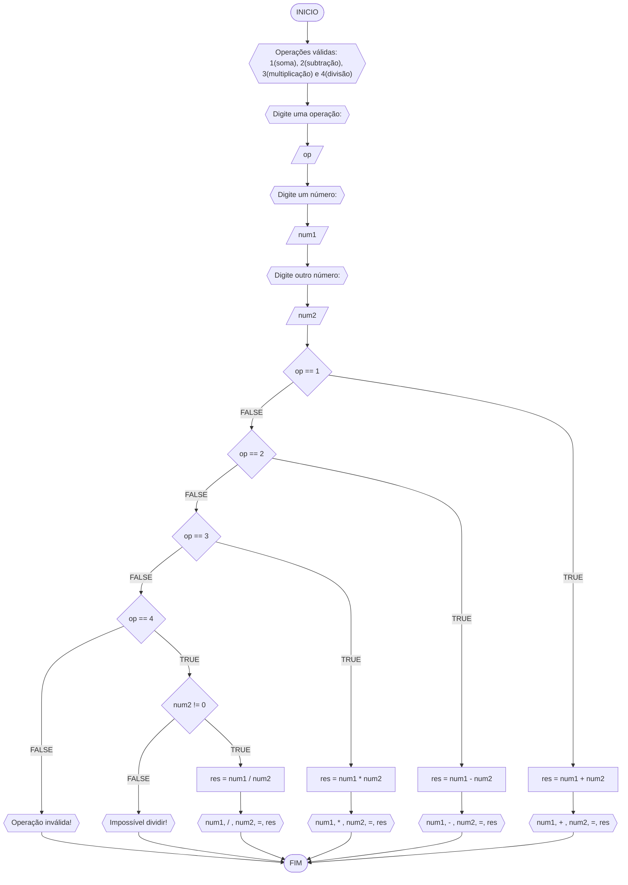
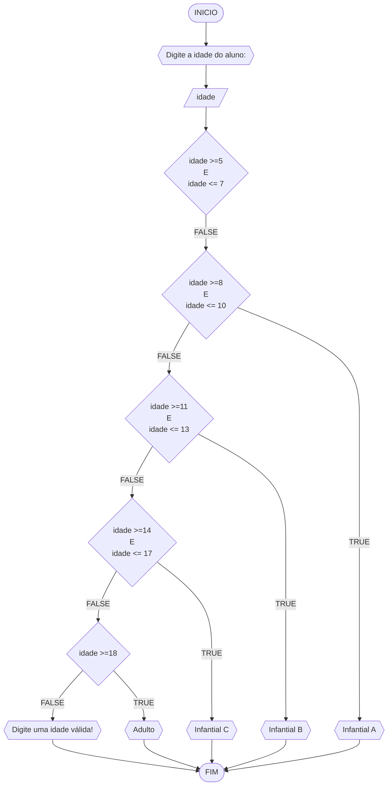

# UNIFOR
**Nome**: Nome do estudante <br>
**Disciplina**: Raciocínio lógico algorítm

## Exercício exemplo
Represente, em fluxograma e pseudocódigo, um algoritmo para calcular o adicional de salário de funcionário por cargo de uma empresa fictícia. Sabe-se que os funcionários de cargo técnico receberão reajuste de 50%, cargo de gerência, um reajuste de 30% e demais, um reajuste de 10%. 

#### Fluxograma


#### Pseudocódigo
```java
ALGORITMO calReajuste
DECLARE  sal, sal_reaj: real, prof: caractere
INICIO
  LEIA sal, prof
  ESCOLHA
    CASO prof == “Técnico”		// caso 1
      sal_reaj ← 1.5 * sal
    CASO prof = “Gerente”		// caso 2
      sal_reaj ← 1.3 * sal
    SENÃO
      sal_reaj ← 1.1 * sal
  FIM_ESCOLHA
  ESCREVA “Salário Reajustado = “, sal_reaj
FIM
```

#### Teste
| sal | prof | prof == “Técnico” | prof = “Gerente” | sal_reaj | Saída |
| -- | -- | -- | -- | -- | -- |
| 1000 | Técnico | V | F | 1500 | “Salário Reajustado = 1500“ |
| 2000 | Gerente | F | V | 2600 | “Salário Reajustado = 2600“ |
| 9000 | Diretor | F | F | 9900 | “Salário Reajustado = 9900“ |

## Lista de exercícios 02

### Exercício 01 (2.5 pontos)
Calcule a média de quatro números inteiros dados.

#### Fluxograma (1.0 ponto)



#### Pseudocódigo (1.0 ponto)

```java
ALGORTIMO Media
DECLARE num1, num2, num3, num4: REAL
INICIO
  ESCREVA "Digite o número 1:"
  LEIA num1
  ESCREVA "Digite o número 2:"
  LEIA num2
  ESCREVA "Digite o número 3:"
  LEIA num3
  ESCREVA "Digite o número 4:"
  LEIA num4
  media <- (num1 + num2 + num3 + num4)/4
  ESCREVA "A média é", media
FIM
```

#### Teste de mesa (0.5 ponto)

| num1 | num2 | num3 | num4 | saída | 
| --   | --   | --   | --   | --    | 
| 0.25 | 0.25 | 2.50 | 1.00 | 1.00  | 

### Exercício 02 (2.5 pontos)
Leia uma temperatura dada em Celsius (C) e imprima o equivalente em Fahrenheit (F). (Fórmula de conversão: F = (9/5) * C + 32)

#### Fluxograma (1.0 ponto)



#### Pseudocódigo (1.0 ponto)

```java
ALGORTIMO ConverteCelsiusFarenheit
DECLARE C, F: REAL
INICIO
  ESCREVA "Digite a temperatura em Celisus:"
  LEIA C
  F <- (9/5) * C + 32
  ESCREVA "A temperatura em Fahrenheit é", F, "graus"
FIM
```

#### Teste de mesa (0.5 ponto)

| C  | F  | saída                                  | 
| -- | -- | --                                     |
| 0  | 32 | A temperatura em Fahrenheit é 32 graus |

### Exercício 03 (2.5 pontos)
Receba dois números reais e um operador e efetue a operação correspondente com os valores recebidos (operandos). 
O algoritmo deve retornar o resultado da operação selecionada simulando todas as operações de uma calculadora simples.

#### Fluxograma (1.0 ponto)



#### Pseudocódigo (1.0 ponto)

```java
ALGORITMO CalculadoraSimples
DECLARE op: INTEIRO; num1,num2,res: REAL
INICIO
  ESCREVA "Operações válidas: 1(soma), 2(subtração), 3(multiplicação) e 4(divisão)"
  ESCREVA "Digite uma operação:"
  LEIA op
  ESCREVA "Digite um número:"
  LEIA num1
  ESCREVA "Digite outro número:"
  LEIA num2
  ESCOLHA
    CASO op == 1
      res = num1 + num2
      ESCREVA num1, "+", num2, "=", res
    CASO op == 2
      res = num1 - num2
      ESCREVA num1, "-", num2, "=", res
    CASO op == 3
      res = num1 * num2
      ESCREVA num1, "*", num2, "=", res
    CASO op == 4
      SE num2 != 0 ENTAO
        res = num1 / num2
        ESCREVA num1, "/", num2, "=", res
      SENAO
        ESCREVA "Impossível dividir!"
      FIM_SE
  SENAO
    ESCREVA "Operação inválida!"
  FIM_ESCOLHA
FIM
```

#### Teste de mesa (0.5 ponto)

| num1 | num2 | op | num2 != 0 | res | saída               | 
| --   | --   | -- | --        | --  | --                  |
| 1    | 0    | 1  |           | 1   | 1 + 0 = 1           |
| 1    | 0    | 2  |           | 1   | 1 - 0 = 1           |
| 1    | 0    | 3  |           | 0   | 1 * 0 = 0           |
| 1    | 0    | 4  | False     |     | Impossível dividir! |
| 1    | 2    | 4  | True      | 0.5 | 1 / 2 = 0,5         |
| 1    | 2    | 5  |           |     | Operação inválida!  |

### Exercício 04 (2.5 pontos)
Elaborar um algoritmo que, dada a idade, classifique nas categorias: infantil A (5 - 7 anos), infantil B (8 -10 anos), juvenil A (11 - 13 anos), juvenil B (14 -17 anos) e adulto (maiores que 18 anos).

#### Fluxograma (1.0 ponto)



#### Pseudocódigo (1.0 ponto)

```
ALGORTIMO ClassificaCategoria
DECLARE idade: INTEIRO
INICIO
  ESCREVA "Digite a idade do aluno:"
  LEIA idade
  ESCOLHA 
    CASO idade >=8 E idade <= 10
      ESCREVA "Infantial A"
    CASO idade >=11 E idade <= 13
      ESCREVA "Infantial B"
    CASO idade >=14 E idade <= 17
      ESCREVA "Infantial C"
    CASO idade >=18
      ESCREVA "Adulto"
  SENAO
    ESCREVA "Digite uma idade válida!"
  FIM_ESCOLHA
FIM
```

#### Teste de mesa (0.5 ponto)

| idade | idade >=8 E idade <= 10 | idade >=11 E idade <= 13 | idade >=14 E idade <= 17 | idade >=18 | saída                       | 
| --    | --                      | --                       | --                       | --         | --                          |
| 4     | False                   | False                    | False                    | False      | Digite uma idade válida!    |
| -4    | False                   | False                    | False                    | False      | Digite uma idade válida!    |
| 8     | True                    | False                    | False                    | False      | Infantial A                 |
| 11    | False                   | True                     | False                    | False      | Infantial B                 |
| 17    | False                   | False                    | True                     | False      | Infantial C                 |
| 21    | False                   | False                    | False                    | True       | Adulto                      |
